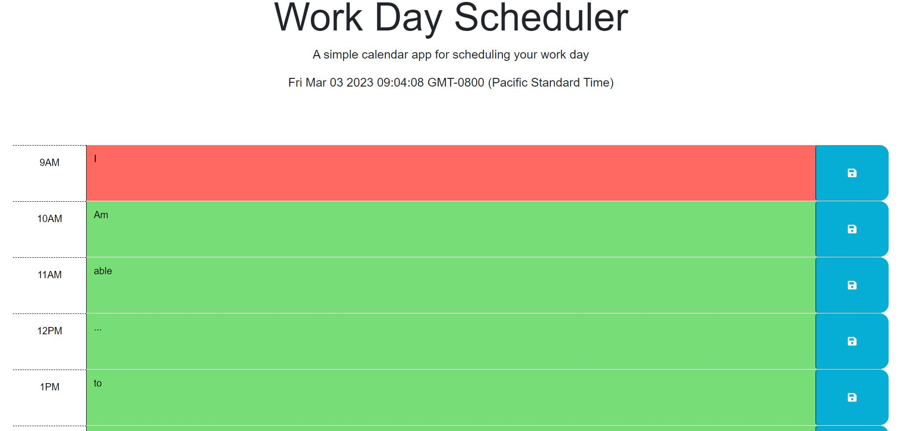
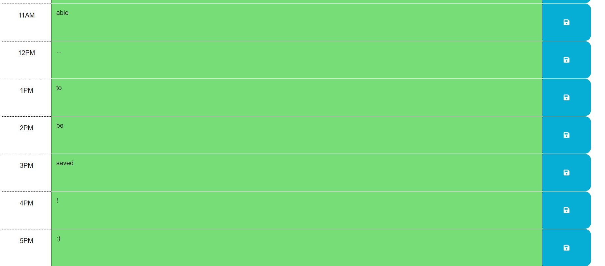

# Work-Day-Calendar

## Description

For this assignment I was tasked with making a day planner. I will be using javascript to make sure the planner is functional and the user is able to interact with it. I used the dayJS function to help create the date and time at the top of the page and was able to make my own boxes for times to allow the user to schedule their day. The user is able to input their tasks or appointments in the time frame boxes which are color coded to represent past, present and future as the time progresses. The user is now able to save tasks or appointments they have in the respective time block to visually see what their day looks like.

## Installation

N/A

## Usage

This application allows the user to plan their week with a day planner. The user will be able to add appointments and tasks they need to get done for the day. The user will be able to see that the past, present and future time blocks are color coded so it is easier to navigate the application.

## Credits

N/A

## License

Please refer to the LICENSE in the repo.

## Criteria for assignment

GIVEN I am using a daily planner to create a schedule

*WHEN I open the planner*
**THEN the current day is displayed at the top of the calendar**

*WHEN I scroll down*
**THEN I am presented with timeblocks for standard business hours**

*WHEN I view the timeblocks for that day*
**THEN each timeblock is color coded to indicate whether it is in the past, present, or future**

*WHEN I click into a timeblock*
**THEN I can enter an event**

*WHEN I click the save button for that timeblock*
**THEN the text for that event is saved in local storage**

*WHEN I refresh the page*
**THEN the saved events persist**

## Repository Link

[Github](https://github.com/PintoDrop/Work-Day)

## Website Link

[Work-Day](https://pintodrop.github.io/Work-Day/)

## Screen Shots

